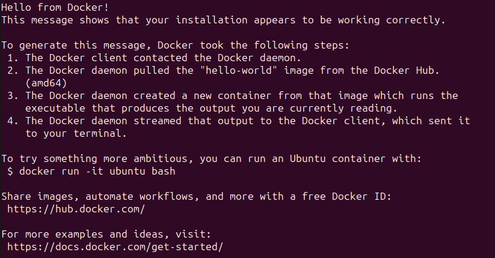
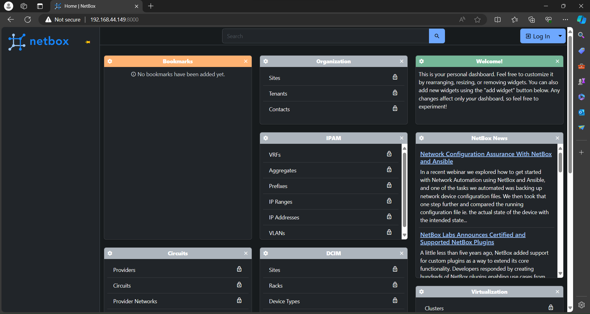

# senior-project #

使用環境
Ubuntu Server 22.04.4 

## Build environment ##

安裝Docker  

```bash
sudo apt-get update
sudo apt-get install ca-certificates curl
sudo install -m 0755 -d /etc/apt/keyrings
sudo curl -fsSL https://download.docker.com/linux/ubuntu/gpg -o /etc/apt/keyrings/docker.asc
sudo chmod a+r /etc/apt/keyrings/docker.asc
echo \
  "deb [arch=$(dpkg --print-architecture) signed-by=/etc/apt/keyrings/docker.asc] https://download.docker.com/linux/ubuntu \
  $(. /etc/os-release && echo "$VERSION_CODENAME") stable" | \
  sudo tee /etc/apt/sources.list.d/docker.list > /dev/null 
sudo apt-get update
sudo apt-get install docker-ce docker-ce-cli containerd.io docker-buildx-plugin docker-compose-plugin
sudo docker run hello-world
```

出現以下畫面就算成功



將user加入至docker群組中，這樣下次就不需要使用sudo也可執行docker

```bash
sudo usermod -aG docker $USER
```

使用docker啟動netbox 

```bash 
git clone -b release https://github.com/netbox-community/netbox-docker.git
cd netbox-docker
tee docker-compose.override.yml <<EOF
version: '3.4'
services:
  netbox:
    ports:
      - 8000:8080
EOF
docker compose pull
docker compose up
```

開啟第二個Terminal用來新增管理員帳號

```bash
docker compose exec netbox /opt/netbox/manage.py createsuperuser 
```

輸入管理員帳號、信箱以及密碼

```bash
Username(leave blank to use 'unit'): #Username
Email address: #E-mail Address
Password: #Password
Password(again): #Password(again)
Superuser created successfully 
```

使用http://IP-Address:8000進入netbox web interface 

